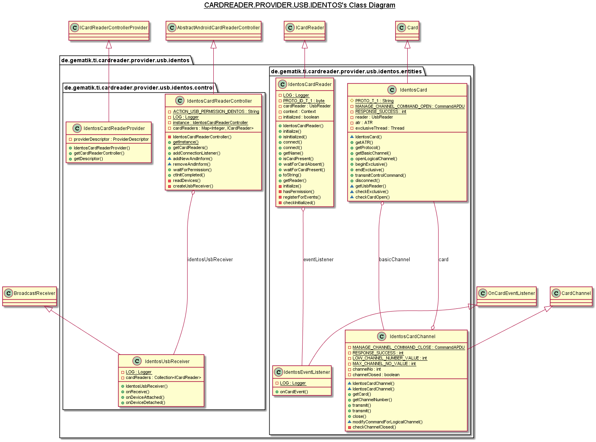
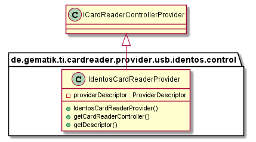
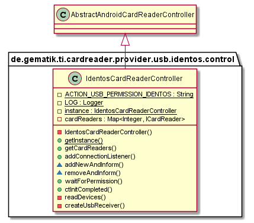
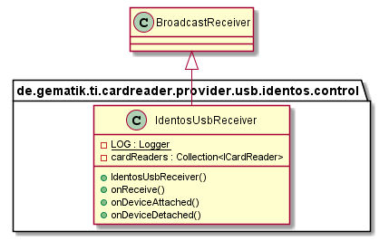
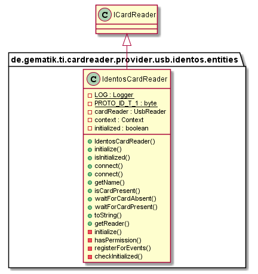
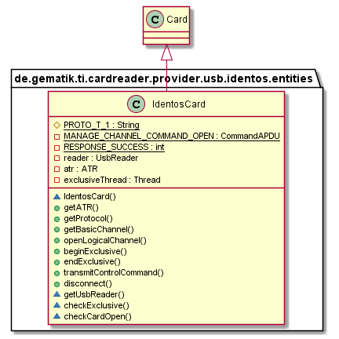
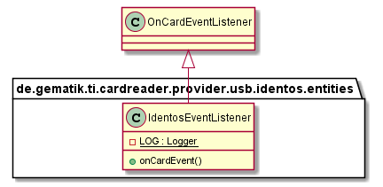
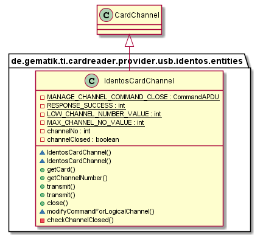

# USB-Identos-CardReaderProvider

## Introduction

This part describes the usage of low level CardReaderProvider for USB IdentosCardReader in your application.

## API Documentation

Generated API docs are available at <https://github.com/gematik/ref-CardReaderProvider-USB-Identos-Android>.

## License

Licensed under the [Apache License, Version 2.0](https://www.apache.org/licenses/LICENSE-2.0).

The USB Identos CardReader provider uses the Software Development Kit (SDK) developed by IDENTOS.
This framework is provided by IDENTOS for use exclusively with the APPIDKEY ID100 Card Reader, and is governed by the terms of use granted by license to users of the ID100 product.

## Overview

  

### Integration

The Identos USB CardReaderProvider needs a descriptor behind `YOUR.PROVIDER\src\main\resources\META-INF\services` with filename `de.gematik.ti.cardreader.provider.spi.ICardReaderControllerProvider` and the content of the package and class which implements the service provider interface `de.gematik.ti.cardreader.provider.usb.identos.control.IdentosCardReaderProvider`.

## Hardware

The integrated Identos id100 library for Android supports the usage of integrating smart card functionality using Identos CardReader.

## Control

### IdentosCardReaderProvider

The IdentosCardReaderProvider class needs implementation of the interface 'ICardReaderControllerProvider' to handle listener and provide methods to inform connected listeners about card reader changes.

  

### IdentosCardReaderController

The IdentosCardReaderController class extends the abstract class 'AbstractCardReaderController' to handle necessary permissions and checking if the application context is set. Returns a list with currently connected Identos cardReaders and informs about reader connection and disconnection.

  

### IdentosUsbReceiver

The IdentosUsbReceiver class extends the BroadCastReceiver class that receives and handles broadcast intents sent by {@link android.content.Context\#sendBroadcast(Intent)}.
The actions of the intents that are being handled are changes in the state of the usb device (attach / detach).

  

## Entities

### IdentosCardReader

The Identos Smart Card Reader implements the Interface ICardReader. Works as adapter to the Identos id100 library for Android.

  

### IdentosCard

A Smart Card with which a connection has been established. IdentosCard extends the abstract class Card. Works as adapter to the Identos id100 library for Android.

  

### IdentosEventListener

EventListener for card events. Works as adapter to the Identos id100 library for Android.

  

### IdentosCardChannel

A logical channel connection to a Smart Card. It is used to exchange APDUs with a Smart Card using USB Identos CardReader. A IdentosCardChannel object can be obtained by calling the method IdentosCard.getBasicChannel() or IdentosCard.openLogicalChannel().

  

## Getting Started

### Build setup

To use CardReaderProvider for Identos USB CardReader in a project, you need just to include following dependency:

**Gradle dependency settings to use CardReaderProvider for Identos USB CardReader library.**

    dependencies {
        implementation group: 'de.gematik.ti', name: 'cardreader.provider.usb.identos', version: '1.1.8'
    }

**Maven dependency settings to use CardReaderProvider for Identos USB library.**

    <dependencies>
        <dependency>
            <groupId>de.gematik.ti</groupId>
            <artifactId>cardreader.provider.usb.identos</artifactId>
            <version>1.1.8</version>
        </dependency>
    </dependencies>
